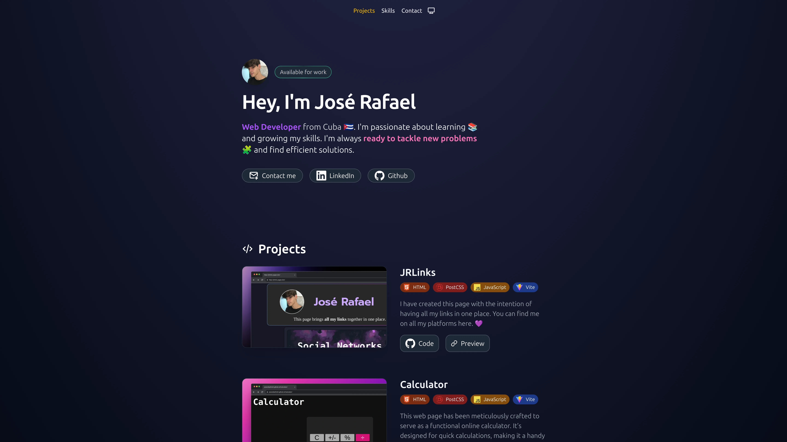
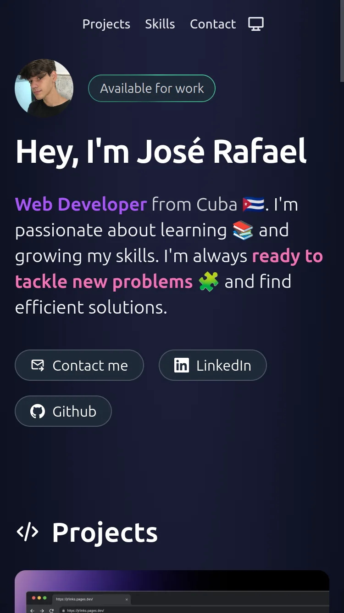

<a id="top"></a>
<h1 align="center"> Portafolio de José Rafael</h1>  
<p align="center">
  <a href="#">
    
  </a>
  <a href="https://opensource.org/licenses/MIT" target="_blank">
    
  </a>
</p>

<div align="center">
    <a href="#-acerca-del-proyecto" target="_blank">
        Acerca Del Proyecto
    </a>
    <span>&nbsp;✦&nbsp;</span>
    <a href="#-vista-previa" target="_blank">
        Vista Previa
    </a>
    <span>&nbsp;✦&nbsp;</span>
    <a href="#-características" target="_blank">
        Características
    </a>
    <span>&nbsp;✦&nbsp;</span>
    <a href="#-tecnologías" target="_blank">
        Tecnologías
    </a>
    <span>&nbsp;✦&nbsp;</span>
    <a href="#-cómo-empezar" target="_blank">
        Cómo Empezar
    </a>
    <span>&nbsp;✦&nbsp;</span>
    <a href="#-comandos" target="_blank">
        Comandos
    </a>
    <span>&nbsp;✦&nbsp;</span>
    <a href="#-contribuciones" target="_blank">
        Contribuciones
    </a>
    <span>&nbsp;✦&nbsp;</span>
    <a href="#-licencia" target="_blank">
        Licencia
    </a>
    <span>&nbsp;✦&nbsp;</span>
    <a href="#-Soporte" target="_blank">
        Soporte
    </a>
</div>
<br>

>Si quieres leer este readme en **inglés**:
>- [**README en Inglés**](https://github.com/joserafael0160/Jose-Rafael-portfolio/blob/main/readme.es.md)

## 📜 Acerca Del Proyecto
Mi portafolio personal, un sitio web donde se exhiben mis habilidades y logros como desarrollador web. Aquí también encontrarás una variedad de proyectos que he creado. Mi portafolio está optimizado para todos los dispositivos, asegurando una experiencia de usuario fluida tanto en computadoras como en móviles. 💜

<p align="right">(<a href="#top" >Volver al inicio 🔝</a>)</p>

## 👀 Vista previa
<h4>In a PC (1920x1080)</h4>



<h4>En un iPhone SE (375x667)</h4>


<p align="right">(<a href="#top">Volver al inicio 🔝</a>)</p>


## 💬 Características
- **Soporte de Favicon**: Se ha añadido soporte para una amplia gama de tamaños de favicon, asegurando que el icono del sitio se muestre correctamente en todos los dispositivos y plataformas.
- **Etiquetas de Open Graph y Twitter**: Se han incluido etiquetas meta de Open Graph y Twitter, que optimizan la vista previa del sitio web en plataformas sociales como Facebook y Twitter.
- **Compatibilidad con Múltiples Navegadores**:  La página web utiliza la etiqueta meta `X-UA-Compatible`, que ayuda a garantizar la compatibilidad con múltiples navegadores, especialmente con versiones antiguas de Internet Explorer.
- **Cambio de tema**: La página web permite a los usuarios cambiar entre los temas claro y oscuro, mejorando la experiencia del usuario.

<p align="right">(<a href="#top">Volver al inicio 🔝</a>)</p>

  
## 🧰 Tecnologías
- [**Astro**](https://astro.build/) - Es un generador de sitios estáticos moderno y rápido. Te permite escribir HTML moderno y renderizarlo a HTML estático en tiempo de compilación.
- [**TypeScript**](https://www.typescriptlang.org/) - Es un superconjunto de JavaScript que añade tipado estático y otros recursos a la lengua. Te ayuda a escribir código más seguro y comprensible.
- [**Tailwind CSS**](https://tailwindcss.com/) - Es un marco de CSS de utilidad primero que te permite construir diseños personalizados rápidamente.
- [**ESLint**](https://eslint.org/) - Es una herramienta de código abierto que te ayuda a encontrar y solucionar problemas con tu código JavaScript.

<p align="right">(<a href="#top">Volver al inicio 🔝</a>)</p>


## 🚀 Cómo Empezar
1. **Haz un Fork** o clona este repositorio

```bash
git clone git@github.com:joserafael0160/Jose-Rafael-portfolio.git
```

2. Instala las dependencias:

- Usé [**bun**](https://bun.sh) para instalar y gestionar las dependencias.
  
```bash
## Instala bun para MacOS, WSL & Linux:
curl -fsSL https://bun.sh/install | bash

# Instala bun para Windows:
powershell -c "iwr bun.sh/install.ps1|iex"

# Instala con bun:
bun install
```

- o puedes usar [**pnpm**](https://pnpm.io):

```bash
# Instala pnpm globalmente si no lo tienes:
npm install -g pnpm

# Instala las dependencias:
pnpm install
```

3. Ejecuta el servidor de desarrollo:

```bash
# Ejecuta con bun:
bun run dev

# Ejecuta con pnpm:
pnpm run dev
```

<p align="right">(<a href="#top">Volver al inicio 🔝</a>)</p>


## 🧞 Comandos
|      | Comando   | Acción                                                       |
| :--- | :-------- | :----------------------------------------------------------- |
| ⚙️    | `dev`     | Inicia el servidor de desarrollo local.                      |
| ⚙️    | `build`   | Construye tu sitio de producción en `./dist/`.               |
| ⚙️    | `preview` | Previsualiza tu construcción localmente, antes de desplegar. |                   |

<p align="right">(<a href="#top">Volver al inicio 🔝</a>)</p>

## 🤝 Contribuciones

¡Las contribuciones son siempre bienvenidas! Ya sea que estés informando errores, solicitando nuevas funciones o mejorando las funcionalidades existentes, tu ayuda es **muy apreciada**.

Si tienes alguna sugerencia que podría mejorar el proyecto, por favor haz un [_fork_](https://github.com/joserafael0160/Jose-Rafael-portfolio/fork) del repositorio y crea una [_pull request_](https://github.com/joserafael0160/Jose-Rafael-portfolio/pulls). También puedes simplemente abrir un [_issue_](https://github.com/joserafael0160/Jose-Rafael-portfolio/issues) con la etiqueta "enhancement".

Aquí tienes una guía rápida:

1. Haz un [_fork_](https://github.com/joserafael0160/Jose-Rafael-portfolio/fork) del Proyecto
2. Clona tu [_fork_](https://github.com/joserafael0160/Jose-Rafael-portfolio/fork) (`git clone <URL del fork>`)
3. Añade el repositorio original como remoto (`git remote add upstream <URL del repositorio original>`)
4. Crea tu Rama de Funcionalidad (`git switch -c feature/CaracteristicaNueva`)
5. Realiza tus Cambios (`git commit -m 'Add: alguna CaracterísticaNueva'`)
6. Haz Push a la Rama (`git push origin feature/CaracteristicaNueva`)
7. Abre una [_pull request_](https://github.com/joserafael0160/Jose-Rafael-portfolio/pulls)

<p align="right">(<a href="#top">Volver al inicio 🔝</a>)</p>

## 🔑 Licencia
[MIT](https://github.com/joserafael0160/Jose-Rafael-portfolio/blob/main/LICENSE)

<p align="right">(<a href="#top">Volver al inicio 🔝</a>)</p>

## 🙏 Soporte
No olvides dejar una estrella ⭐️

<p align="right">(<a href="#top">Volver al inicio 🔝</a>)</p>

<br>
<hr>
<p align="center">✌️</p>
<p align="center">
<sub><sup>Un proyecto creado por <a href="https://github.com/joserafael0160">@joserafael0160</a></sup></sub>